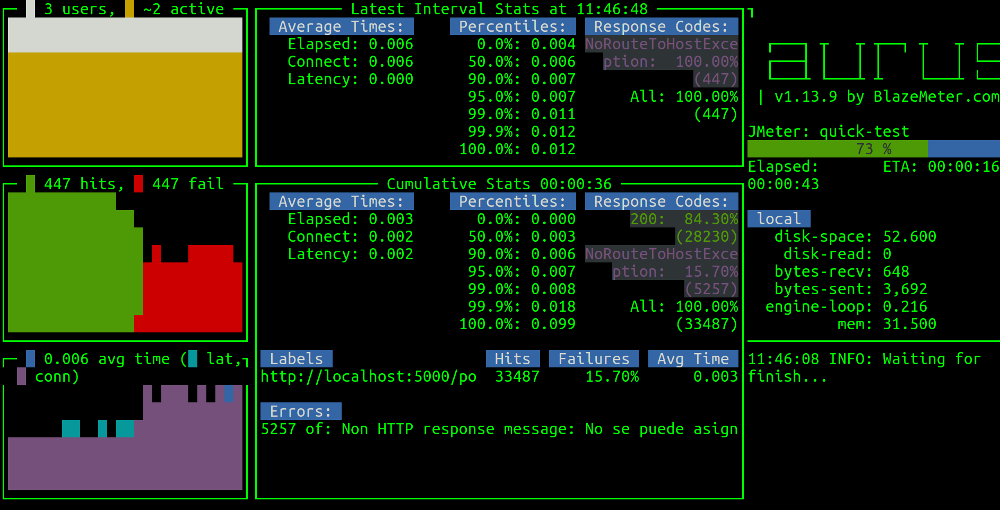
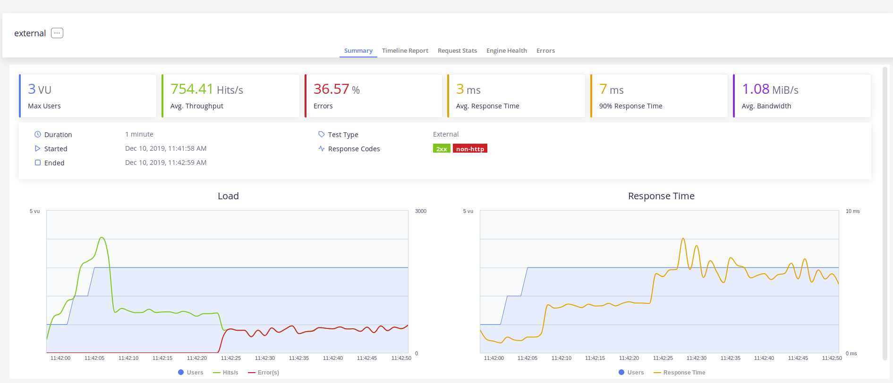

# Cuarto hito: Completar microservicios a un nivel de prestaciones determinado

Descripción
-----------------

En hitos anteriores se ha solicitado crear al menos un microservicio,
y que use un contenedor. En este hito se tiene que extender el
anterior de varias formas:

1. Extender los microservicios con el almacenamiento de datos que se
haya elegido para ellos.

2. Programar el resto de los microservicios.

3. Extender el nivel de prestaciones de los microservicios, de forma que
sean capaces de alcanzar un nivel aproximado de 1000 peticiones por
segundo.

Prerrequisitos
--------------------

Haber superado el hito anterior y haber alcanzado el 60% de los
objetivos del material correspondiente de la asignatura. En el caso de
que no se haya hecho, no se calificará este hito del proyecto.

Explicación
----------------

El principal objetivo de esta práctica es entender el concepto de SLA,
[service level
agreement](https://en.wikipedia.org/wiki/Service-level_agreement): se
trata de una de los requisitos esenciales en un proyecto, y consiste
en decidir cuál es la carga que un sistema debe soportar y ceñirse a
la misma a la hora de pasarlo a producción. También consiste en
entender qué es un nivel aceptable de prestaciones. En un
microservicio el nivel medio de prestaciones debería ser varios
cientos por segundo, de forma que cada petición se sirva en un tiempo
del orden de una milésima.

La forma principal de conseguir esto es a través del diseño, es decir,
de realizar una serie de elecciones, tanto de herramientas como de
arquitectura de las mismas, que permita alcanzar ese nivel de
prestaciones, y además escalarlo hasta un nivel necesario. Un nivel
base de 1k peticiones con éxito por segundo es una buen punto de
partida, pero si se puede escalar como máximo a 3k tampoco es
demasiado interesante. Hay varios elementos fundamentales en el diseño
que permiten este tipo de escalado.

* Usar un almacén de datos que, primero, permita la replicación del
  servicio, y segundo, pueda también escalar con el número de
  peticiones. El almacén de datos debe ser suficientemente rápido como
  para soportar o el nivel base o un número de répicas adecuadas para
  alcanzar ese nivel base; pero también se debe poder escalar de forma
  que haya varios servicios, con varios almacenes de datos
  sincronizados, para llegar a donde sea necesario.
  
> Se recuerda que la forma correcta de usar conexiones de datos en una
> clase o microservicio es usar el principio de inversión de
> dependencias: los servicios de datos deben ser intercambiables, con
> un interfaz común, e *inyectarse* en la clase que los vaya a usar en
> el momento de la construcción.

* Desacoplamiento de la generación de los datos y el servicio de los
  mismos. En una arquitectura de microservicios, no se pueden hacer
  peticiones a un tercer servicio cada vez que se haga una petición al
  principal, porque las peticiones tardan un tiempo indeterminado y se
  suman las latencias y la concurrencia. Escribir en el almacén de
  datos se debe hacer de forma asíncrona, leer del almacén de datos se
  debe hacer directamente, pero *en ese momento* no se debe hacer la
  petición para que llegue al almacén de datos.
  
* Uso de cachés a todos los niveles posibles: entre el servidor y el
  servicio, interna al servicio, entre el servicio y el almacén de
  datos.
  
Si las prestaciones son un requisito, se deben incluir en los tests de
forma que si no se alcanza el nivel determinado o se cae por debajo de
ese nivel, se provoque un error.

Para medir las prestaciones, hay que tener en cuenta, sobre todo, el
número de peticiones concurrentes que es capaz de admitir un
microservicio. Las peticiones base serán sobre un solo servicio, pero
las peticiones concurrentes tratarán de hacer, a la vez, varias
peticiones. En general, un solo servicio se degradará cuando se
comiencen a hacer varias peticiones concurrentes y, a partir de un
número determinado de peticiones en la cola, acabará provocando
errores.

Para medir esto hay diferentes herramientas. Herramientas como
[Locust](https://locust.io), JMeter o Apache Benchmark son
relativamente básicas, porque permiten ver la foto de un momento
determinado. Sin embargo, [Taurus](http://gettaurus.org/) es un
front-end que permite llevar a cabo este tipo de peticiones, y crear
informes detallados sobre las prestaciones de un microservicio.

Por ejemplo, podemos hacer una configuración básica para Taurus así:

```yaml
execution:
- concurrency: 3
  ramp-up: 10s
  hold-for: 50s
  scenario: quick-test

scenarios:
  quick-test:
    requests:
    - http://localhost:5000/porras
```

Llegará desde 1 a 3 usuarios en 10 segundos, y mantendrá los 10
usuarios durante 50 segundos. Este período es importante, porque
cuando el servicio no puede servir, eventualmente empieza a devolver
errores. Lo vamos a lanzar sobre una aplicación
[hecha con Node.js y Express](https://github.com/node-app-cc) que se
ha lanzado con un solo servidor y poblado con un par de
elementos. Ejecutándolo con `bzt quick_test.yml -report` obtenemos
interactivamente en consola lo siguiente:



Se ve claramente cómo las prestaciones empiezan a deteriorarse a
partir de dos usuarios, hasta el punto que cuando lleva unos segundos
el servicio se satura y empieza a arrojar sólo errores.

Aparece mucho mejor en la web:



Donde se aprecia más o menos lo mismo, incluyendo la tasa de error en
la que se incurre para más de dos usuarios simultáneos.

> Incidentalmente, Apache Benchmark no es capaz de dar este
> detalle. Aunque sí daría correctamente el número de peticiones con
> éxito, el hecho de saturar el servidor y dar un número de peticiones
> erróneas no se reflejaría en la medida mostrada.

Para medir las prestaciones con precisión y alcanzar el nivel de
prestaciones determinado, que deberá ser 1000 peticiones para 10
usuarios concurrentes, deberemos usar este método (u otro que permita
llevar a cabo este tipo de cosas fácilmente).

En principio, no será necesario que se use ningún tipo de contenedor;
será más fácil configurar y lanzar el servicio desde local. Sí es
cierto que, cuando se alcance un nivel de prestaciones determinado,
convendrá medirlo dentro del contenedor (o contenedores), para ver si
se degrada mucho las prestaciones, o cuanto se degradan dependiendo
del sistema operativo del mismo.


Entrega de la práctica
--------------------------------

Subir los fuentes a GitHub y hacer un *pull request* al documento de entregas como es habitual.

El URL de la imagen pública en DockerHub o en otro registro se tendrá que
incluir de esta forma:

	Prestaciones: fichero_de_medicion.yml

Este fichero será el que se haya usado en Taurus (u otra herramienta
similar) para medir las prestaciones del microservicio.

Valoración
--------------

* 2 puntos: Fichero de configuración del sistema de medición de
  prestaciones correcto y bien explicado.
* 2 puntos: Mostrar tablas y/o gráficos de uso del sistema de medición
  de prestaciones para varias configuraciones posibles, hasta alcanzar
  el nivel requerido de 1000 peticiones para 10 usuarios concurrentes
  con 0% errores.
* 2 puntos: explicación de las herramientas y cambios llevados a cabo
  para mejorar las prestaciones desde el nivel inicial.
* 2 puntos: configuración correcta del acceso a datos usando inversión
  de dependencias.
* 2 puntos: puntos adicionales por grado de terminación, organización
  de la documentación, esfuerzo especial. 

Se recuerda que se considerará **plagio** si el código o parte de él usados está copiados
directamente de ejemplos, sea de la herramienta o de tutoriales.
